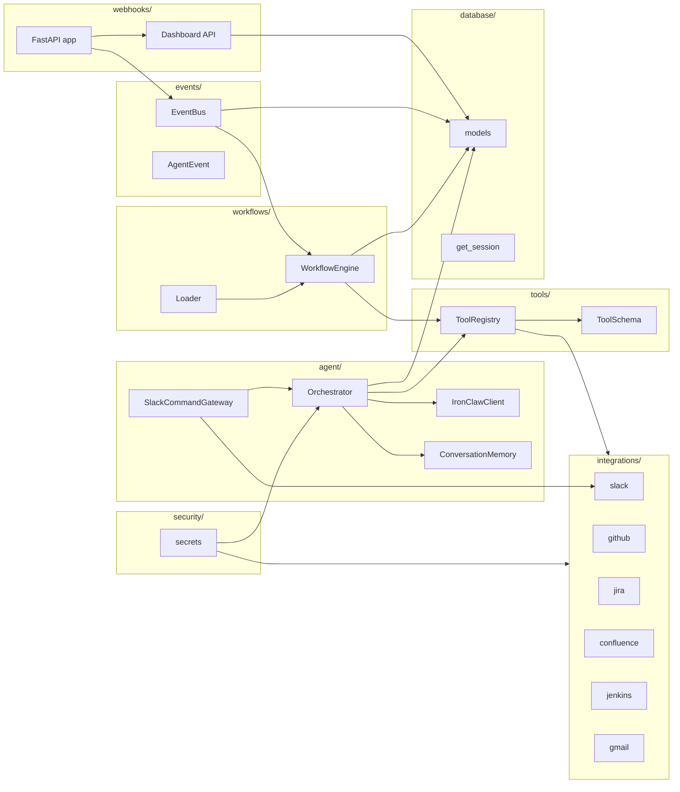
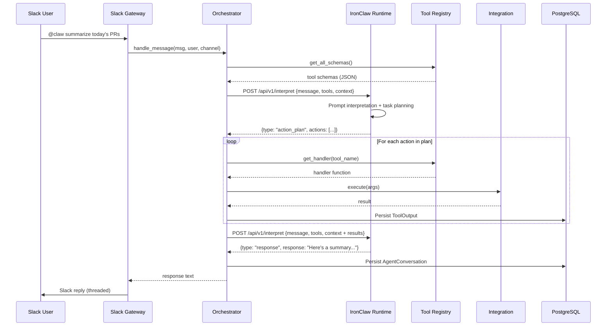
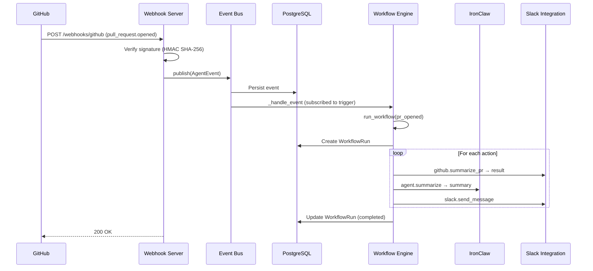
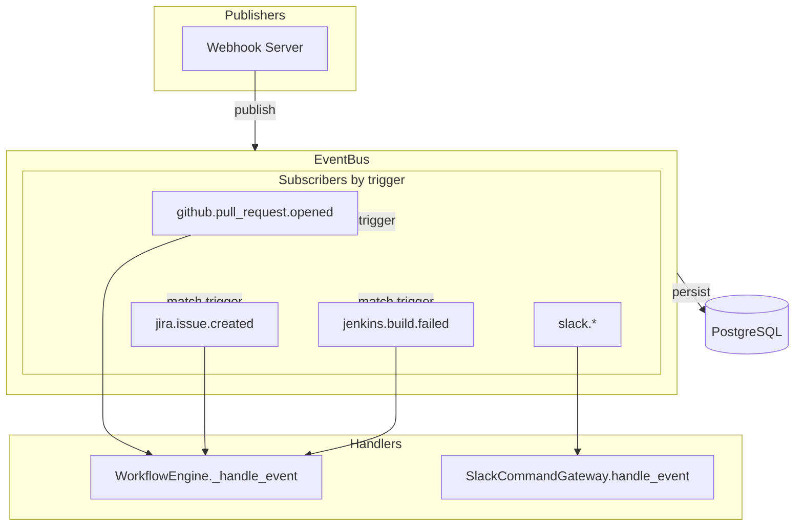
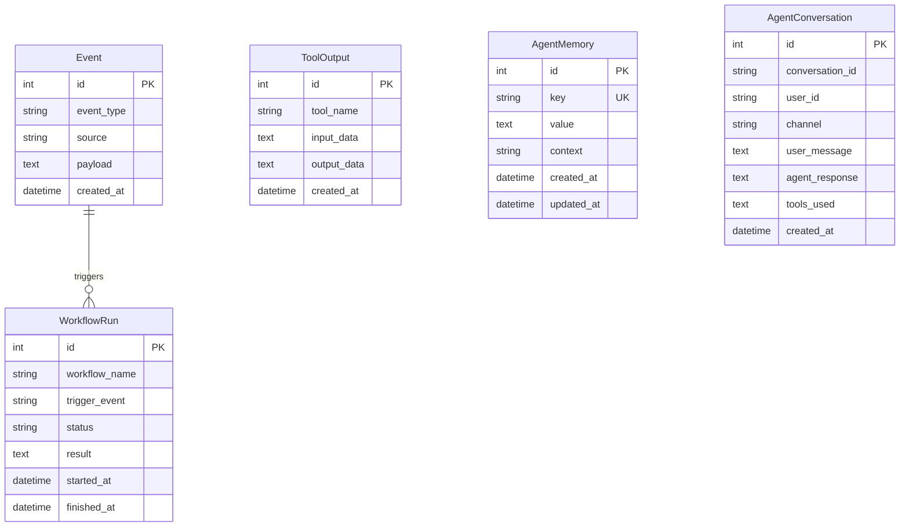
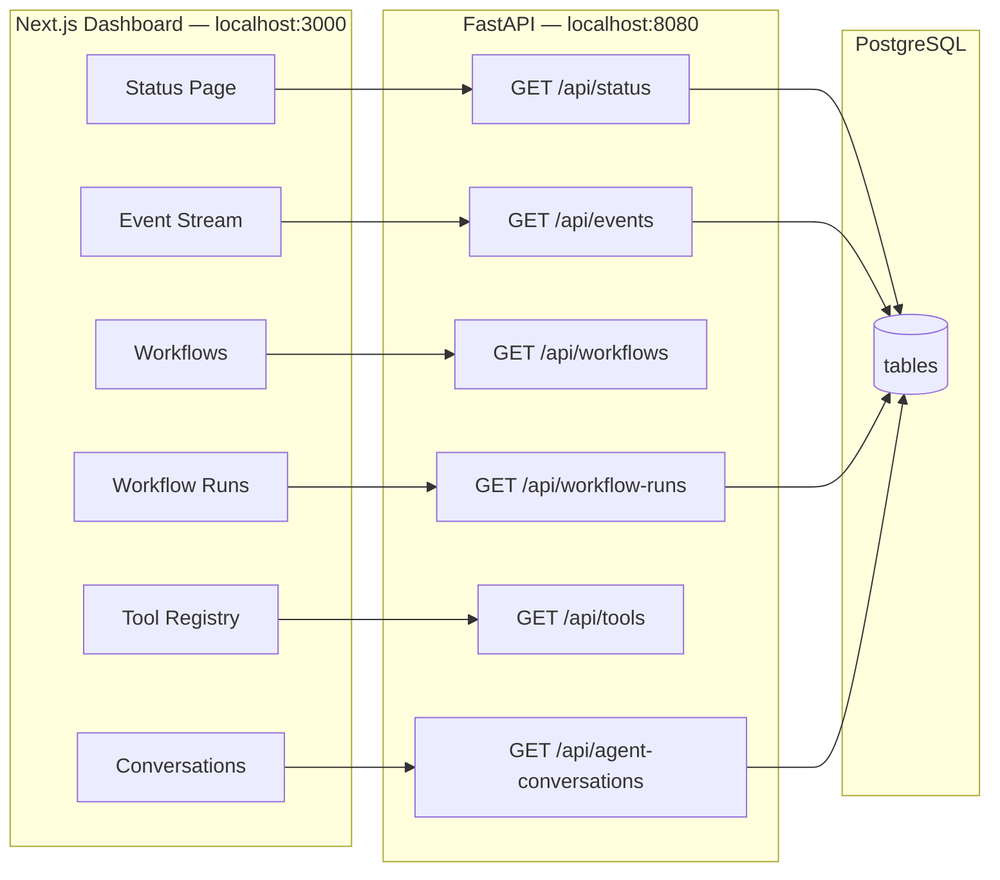

# Claw Agent — Architecture Diagrams

This document describes the architecture and data flows using Mermaid diagrams. Render in GitHub, VS Code (with Mermaid extension), or [mermaid.live](https://mermaid.live).

---

## 1. System Overview

```mermaid
flowchart TB
    subgraph External["External Services"]
        GH[GitHub]
        J[Jira]
        JK[Jenkins]
        SL[Slack]
        GM[Gmail]
        CF[Confluence]
    end

    subgraph Dashboard["Web Dashboard — localhost:3000"]
        FE[Next.js + Tailwind]
    end

    subgraph ClawAgent["Claw Agent — Python Orchestrator — localhost:8080"]
        subgraph Entry["Entry Points"]
            SGW[Slack Command Gateway]
            WH[Webhook Server]
            API[Dashboard API]
        end

        subgraph Core["Core"]
            ORCH[Orchestrator]
            EB[Event Bus]
            WE[Workflow Engine]
            TR[Tool Schema Registry]
        end

        subgraph Tools["Integration Connectors"]
            SL_I[Slack]
            GH_I[GitHub]
            J_I[Jira]
            CF_I[Confluence]
            JK_I[Jenkins]
            GM_I[Gmail]
        end
    end

    subgraph IronClaw["IronClaw Runtime — Rust — localhost:9090"]
        IC_I[Prompt Interpretation]
        IC_P[Task Planning]
        IC_T[Tool Selection]
        IC_S[Summarization]
    end

    subgraph Persistence["PostgreSQL — localhost:5432"]
        DB[(PostgreSQL)]
    end

    SL -->|@claw commands| SGW
    GH -->|webhook| WH
    J -->|webhook| WH
    JK -->|webhook| WH
    SL -->|webhook| WH

    SGW --> ORCH
    ORCH -->|interpret / plan| IronClaw
    IronClaw -->|action plan| ORCH
    ORCH --> TR
    TR --> Tools
    WH --> EB
    EB --> WE
    WE --> TR
    EB --> DB
    WE --> DB
    ORCH --> DB

    FE -->|fetch| API
    API --> DB
```

---

## 2. Component Diagram



---

## 3. IronClaw Communication Flow



---

## 4. Webhook → Workflow Flow



---

## 5. Event Bus (Pub/Sub)



---

## 6. Data Model



---

## 7. Dashboard Architecture



---

## 8. Supported Event Types

| Source     | Example triggers                                      |
|------------|-------------------------------------------------------|
| GitHub     | `github.pull_request.opened`, `github.issues.opened`  |
| Jira       | `jira.issue.created`, `jira.issue.updated`             |
| Jenkins    | `jenkins.build.failed`, `jenkins.build.completed`      |
| Slack      | `slack.app_mention.received`, `slack.message.received` |

Workflows subscribe to these triggers via `workflows/*.yaml` `trigger` fields.

---

## 9. Tool Schema Registry

Each tool registers with:

| Field        | Type              | Description                        |
|--------------|-------------------|------------------------------------|
| `name`       | `string`          | Unique identifier                  |
| `description`| `string`          | Human-readable purpose             |
| `parameters` | `JSON Schema`     | Input parameter schema             |
| `handler`    | `Callable`        | Python function that executes tool |

Tool schemas are sent to IronClaw so it can select and parameterize tools during planning.
